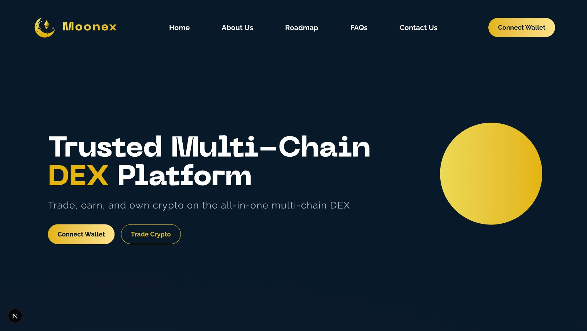
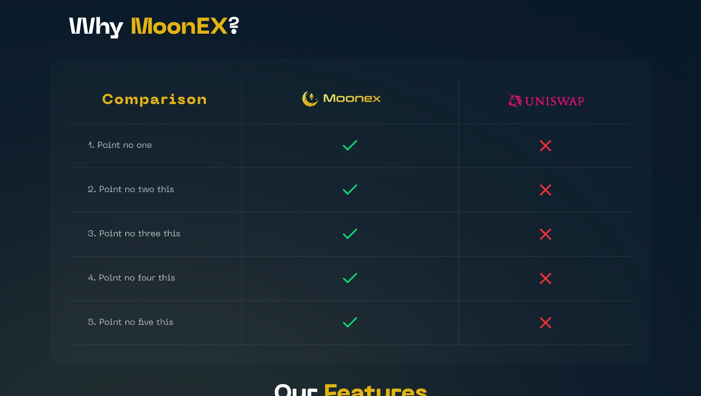
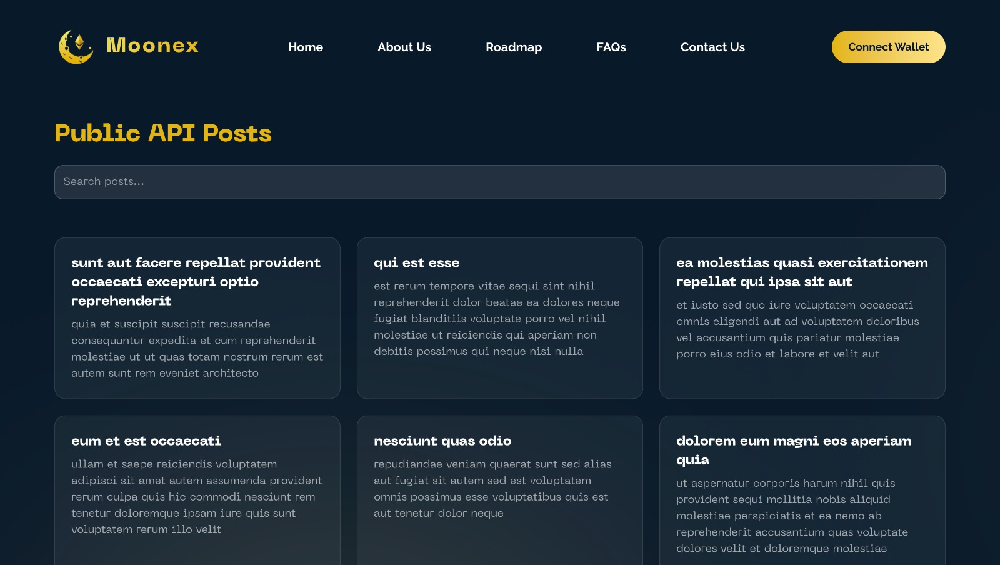

# Moonex🌙

Trusted multi-chain DEX platform. Trade, earn, and own crypto on the all-in-one multi-chain DEX.

## Preview

👉 [Experiment it Live!](https://moonex-seven.vercel.app/)
## Screenshots

### Landing Page


### View Feedbacks Page


### Public API Page (/posts)

## Tech Stack

- **Framework**: [Next.js](https://nextjs.org/)  
- **Language**: TypeScript  
- **Styling**: Tailwind CSS
- **Icons**: Lucide React Icons
- **Public API**: [Json Placeholder Posts API](https://jsonplaceholder.typicode.com/posts)

## Usage


- Open the homepage `(/)` to view Landing Page.

- Navigate to `/posts` to view public API data.
## Installation Guide

### ✅ Prerequisites

Before you begin, make sure you have:

- **Node.js** (v20 or later) – [Download](https://nodejs.org/)
- **npm** or **yarn**

### Clone the Repository

```bash
git clone https://github.com/lipika1911/moonex.git
```

### Install Dependencies

```bash
npm install
```

### Run the App

```bash
npm run dev
```

### ✅ You’re all set!
- Open http://localhost:3000 in your browser.